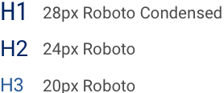

# Prueba Ingreso Front-End Designer

## Objetivo
Construir la pieza gráfica que se encuentra en el repositorio. 

## Instrucciones
Para ello haga fork de este proyecto junto a un commit inicial para poder registrar el tiempo que le lleva realizar la tarea.

## Requisitos
* Bootstrap ^3
* Angular ^1.3.x

## Deseable
* Bootstrap UI
* BEM
* Preprocesador CSS

## Información adicional

